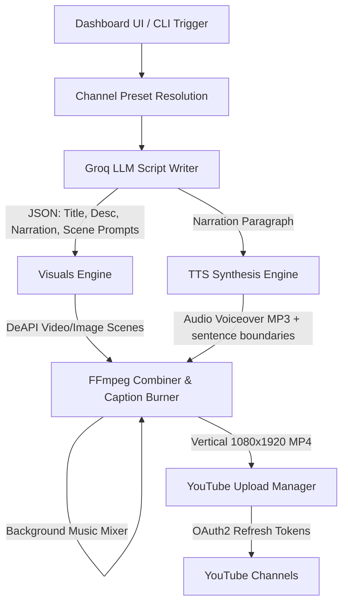

# 🎬 ShortsForge AI — Vertical Video Automation Engine 🚀

ShortsForge AI is a production-grade, fully automated vertical video (YouTube Shorts, TikToks, Reels) generation engine. Featuring a gorgeous React dashboard, automatic script generation, high-context AI visuals, natural voice synthesis, custom caption rendering, background music mixing, and direct YouTube API uploads, it allows you to run a multi-channel video content network for **$0/day**.

<p align="center">
  
  
  
  
</p>

---

## 📸 Dashboard Showcase

ShortsForge features a complete React + Tailwind + Vite web control panel. View generation status, inspect past runs, customize presets on the fly, and trigger manual YouTube uploads directly from the UI.

```
+-------------------------------------------------------+
|  ShortsForge AI                      [Runner] [History] |
+-------------------------------------------------------+
|  CHANNELS: [ Formula 1 Stories ]  [Still Images/Video]|
|  TOPIC:    [ Usain Bolt's untied shoelace            ]|
|  ACTION:   [ GENERATE SHORT ]  [x] Upload immediately |
+-------------------------------------------------------+
|  ShortsForge Pipeline: Rendering video...             |
|  [x] Script -> [x] Visuals -> [/] Voice -> [ ] Render |
+-------------------------------------------------------+
|  CONSOLE LOGS:                                        |
|  [Bot Log]  Edge TTS synthesizing (en-GB-Ryan)...     |
|  [Bot Log]  Mixing background track at 8% volume...   |
+-------------------------------------------------------+
```

---

## 🧠 Architecture Flow



---

## 🔥 Features & Enhancements

*   **🎨 Real-Time Visual Progress Stepper**: Track your bot pipelines instantly on the dashboard with a dynamic checklist tracking the active stage (`Script` -> `Visuals` -> `Voice` -> `Render` -> `Upload` -> `Done`).
*   **🎵 Background Music Mixer**: Automatically scans `assets/music/` for audio tracks, picks one at random, loops it, and blends it into the background of your Shorts at `8%` volume (`amix` filter) so that it doesn't overpower the voiceover.
*   **🎙️ Natural Edge TTS Voice Pacing**: Narration voice speed is automatically paced at `-5%` rate (featuring premium, natural voices like `en-GB-RyanNeural`), creating a much more comfortable, professional, and high-retention listening experience.
*   **🚀 Resilient DeAPI Image & Video Pipelines**: Automatically fetches still images or video clips from DeAPI. Equipped with an auto-cooldown staggered system (defaults to `35s` in `.env`) to prevent rate limits, and a long-polling wait handler (`max_polls = 60`) to tolerate slow server queues.
*   **🛠️ Groq JSON Formatting Auto-Recovery**: If the LLM generates unescaped newlines or invalid syntax, the engine captures the formatting error, feeds the specific failure reason back to the AI model, and retries generation automatically up to 4 times.
*   **🌐 Rich Niche Presets System**: Custom prompts, fonts, and negative prompts tailored for high-CTR channels:
    *   `f1_stories`: Formula 1 History & Rivalries (`en-US-BrianNeural` + `Bebas Neue` font).
    *   `cricket_stories`: Cricket Legends & Records (`en-GB-RyanNeural` + `Bebas Neue` font).
    *   `sports_universe`: General Sports Anomalies & Olympic Stories (`en-US-ChristopherNeural` + `Bebas Neue` font).
    *   `dark_psychology`: Covered Persuasion & Body Language (`en-US-ChristopherNeural` + `Creepster` font).
    *   `stoic_wisdom`: Stoicism lessons (`en-US-AndrewNeural` + `Bebas Neue` font).
    *   `facts`, `ghost_stories`, `school_story`, `psych_tradeoff`, `history_micro`, etc.

---

## 🛠️ Installation & Setup

### Prerequisites
*   Python **3.13+**
*   Node.js & npm (for Web Dashboard)
*   **FFmpeg** installed on your system path:
    ```bash
    brew install ffmpeg      # macOS
    sudo apt install ffmpeg  # Linux
    ```

### 1. Backend Setup
Clone the repository, configure the virtual environment, and install dependencies:
```bash
git clone https://github.com/shashanthnetha/ShortsForge.git
cd ShortsForge

# Setup Virtual Environment
python3 -m venv .venv
source .venv/bin/activate  # On Windows: .venv\Scripts\activate
pip install -r requirements.txt
```

### 2. Configure Environment Variables
Copy the template file to `.env` and fill in your API tokens:
```bash
cp .env.example .env
```
Open `.env` and configure:
```env
GROQ_API_KEY=your_groq_key_here
DEAPI_TOKEN=your_deapi_token_here
DEAPI_COOLDOWN=35  # Staggers DeAPI requests to prevent 429 rate limits
```

### 3. Run the Web Dashboard
Start both the FastAPI backend (running on port `8000`) and the React frontend (Vite dev server on port `5173`) concurrently:
```bash
npm install
npm run dev
```
Open your browser to `http://localhost:5173/` to control the bot.

---

## 💻 CLI Command Reference

If you prefer to run the pipeline directly from your terminal:

```bash
# Generate F1 Short (Image Mode)
.venv/bin/python scripts/run_short.py --channel f1_stories --visual-mode image

# Generate Cricket Short (Video Mode)
.venv/bin/python scripts/run_short.py --channel cricket_stories --visual-mode video

# Generate and Upload to YouTube directly
.venv/bin/python scripts/run_short.py --channel sports_universe --upload --privacy private
```

---

## 🔐 YouTube Upload Setup (OAuth2)

1.  Go to the [Google Cloud Console](https://console.cloud.google.com/).
2.  Enable the **YouTube Data API v3**.
3.  Navigate to **Credentials** -> **Create Credentials** -> **OAuth client ID** (select **Desktop App**).
4.  Download the credentials JSON and save it as `secrets/client_secret.json`.
5.  Run the authentication helper script:
    ```bash
    .venv/bin/python scripts/youtube_auth.py
    ```
6.  Follow the browser authorization flow. The token will be securely saved locally to `secrets/youtube_token.json` for subsequent manual or automatic uploads.

---

## 📂 Project Structure

```
ShortsForge/
├── assets/
│   ├── fonts/           # TrueType font files (BebasNeue, Creepster, Noto)
│   └── music/           # Background tracks (.mp3, .wav) mixed into the Short
├── dashboard/
│   ├── backend/         # FastAPI backend (main.py API, runs controller)
│   └── frontend/        # React, Vite, Tailwind UI dashboard
├── pipeline/
│   ├── captions.py      # Burn-in subtitle timings generator
│   ├── channel_presets.py # Niche rules, prompts, fonts, and topic pools
│   ├── edge_tts_synth.py # Microsoft Edge TTS audio engine
│   ├── groq_script.py   # Groq LLM script layout generator
│   ├── images.py        # DeAPI video and scene generator
│   └── render_short.py  # FFmpeg video crossfading, scaling, and mixing
├── scripts/
│   ├── run_short.py     # Main CLI orchestrator
│   └── youtube_auth.py  # One-time Google OAuth2 login helper
├── .env.example         # Template configuration settings
└── package.json         # Concurrently dev commands manager
```

---

## 📜 License & Credits

*   **Lead Developer**: **Sha** (Shashanth Netha/Pittala)
*   **Original Template Contributors**: Special thanks to **Aarav Maloo** and **Lucky Negi** for the initial foundations of the YouTube shorts automation scripts.

Distributed under the MIT License. Feel free to use, modify, and build upon this project for your own automation channels!
